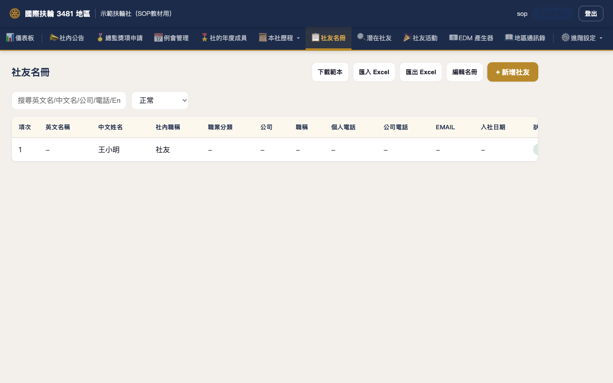
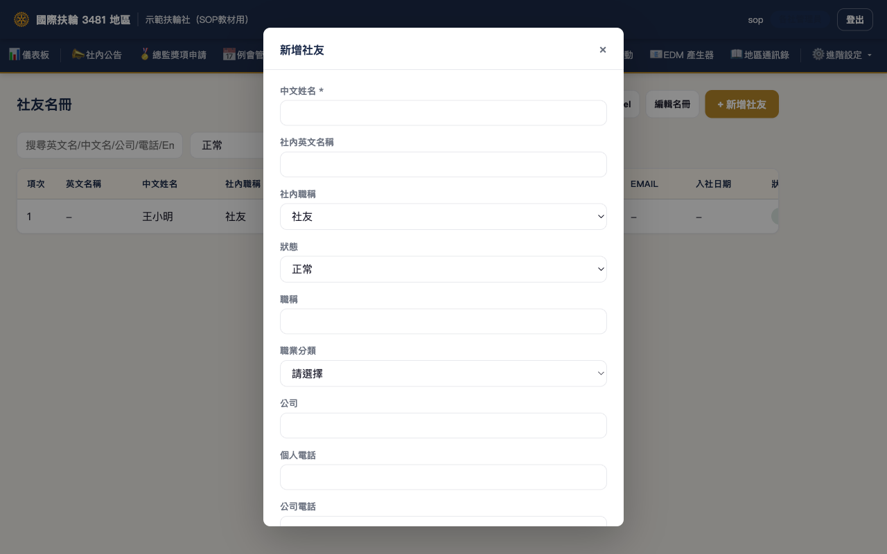
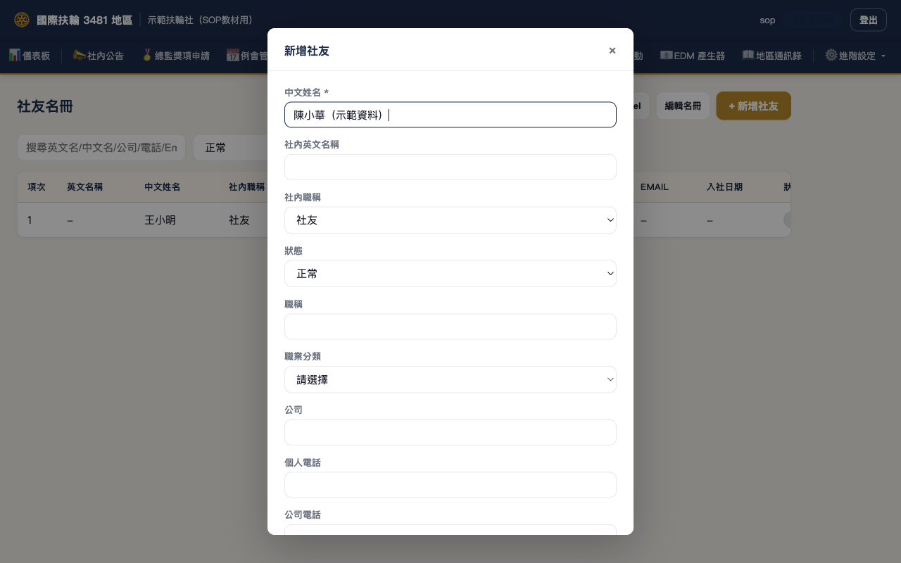
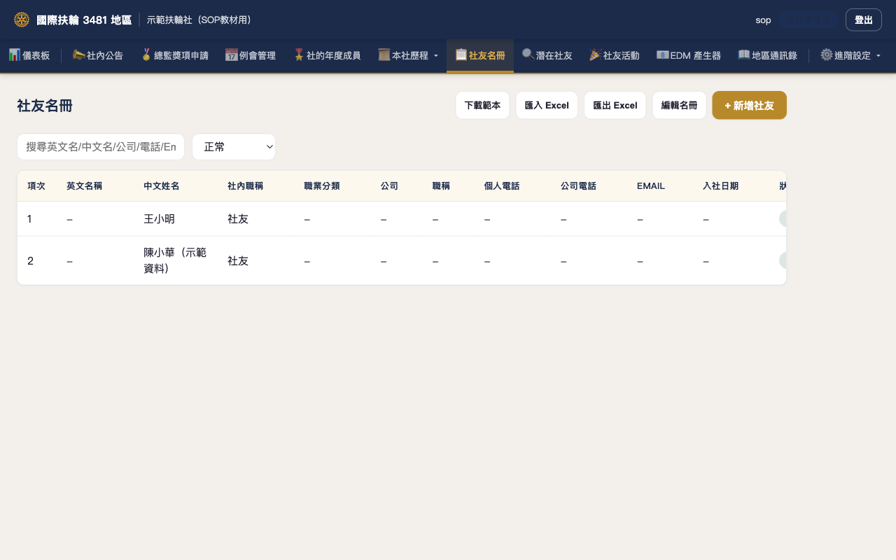

# D3481 社務管理平台 功能操作 SOP
### 進度預覽版

> 本文件示範對象：<strong>社長 / 執秘</strong>（社團端使用者）與<strong>地區管理員</strong>兩種視角。
> 目前僅完成「社友名冊 → 新增社友」一段操作示範，其餘章節仍在進行中，本版本作為排版與進度預覽。
> 最後整理日期：2026-07-08

---

## 目錄

1. 文件說明與示範帳號
2. 社友名冊：登入與進入名冊頁
3. 社友名冊：新增社友
4. 尚未完成的章節

---

## 1. 文件說明與示範帳號

本文件所有畫面截圖，皆使用專為教材建立的<strong>示範扶輪社（SOP教材用）</strong>與示範帳號實際操作平台正式站取得，非合成示意圖。

| 項目 | 內容 |
|------|------|
| 示範社團 | 示範扶輪社（SOP教材用） |
| 示範帳號 | sop@gmail.com（社長 / 執秘角色） |
| 操作範圍 | 社友名冊、帳號管理、例會管理、地區通訊錄 |

> 示範資料僅供教學使用，畫面中出現的社友姓名（王小明、陳小華）皆為示範資料，非真實社友。

---

## 2. 社友名冊：登入與進入名冊頁

### 步驟 1：開啟登入頁

使用瀏覽器開啟平台網址，進入登入頁。

### 步驟 2：輸入帳號密碼

在「帳號」欄輸入 Email 或手機號碼，「密碼」欄輸入密碼，點擊「登入」。

### 步驟 3：登入後進入社友名冊

登入成功後，點擊上方選單「社友名冊」，即可看到目前社團的社友清單。

---

## 3. 社友名冊：新增社友

### 步驟 1：點擊「+ 新增社友」

在社友名冊頁右上角，點擊「+ 新增社友」按鈕，會彈出新增表單。

### 步驟 2：填寫社友資料

至少填寫「中文姓名」（必填欄位），其餘欄位可選填，包含社內英文名稱、社內職稱、狀態、職稱、職業分類、公司、電話等。

### 步驟 3：儲存並確認

點擊「儲存」後，跳回社友名冊頁，可看到新增的社友已出現在列表中。

---

## 4. 尚未完成的章節

以下章節尚未拍攝與撰寫，將於後續版本補上：

- [ ] 社友名冊：編輯既有社友
- [ ] 社友名冊：Excel 匯入 / 匯出
- [ ] 帳號管理：邀請本社帳號、帳號列表、停用 / 啟用
- [ ] 例會管理：新增例會、出席彙總登記、逐人出席勾選
- [ ] 地區通訊錄：瀏覽、分區篩選、搜尋
- [ ] 地區管理員視角：邀請 / 管理地區帳號、社團總覽

> 詳細進度追蹤請見 `docs/sop/PROGRESS.md`。
